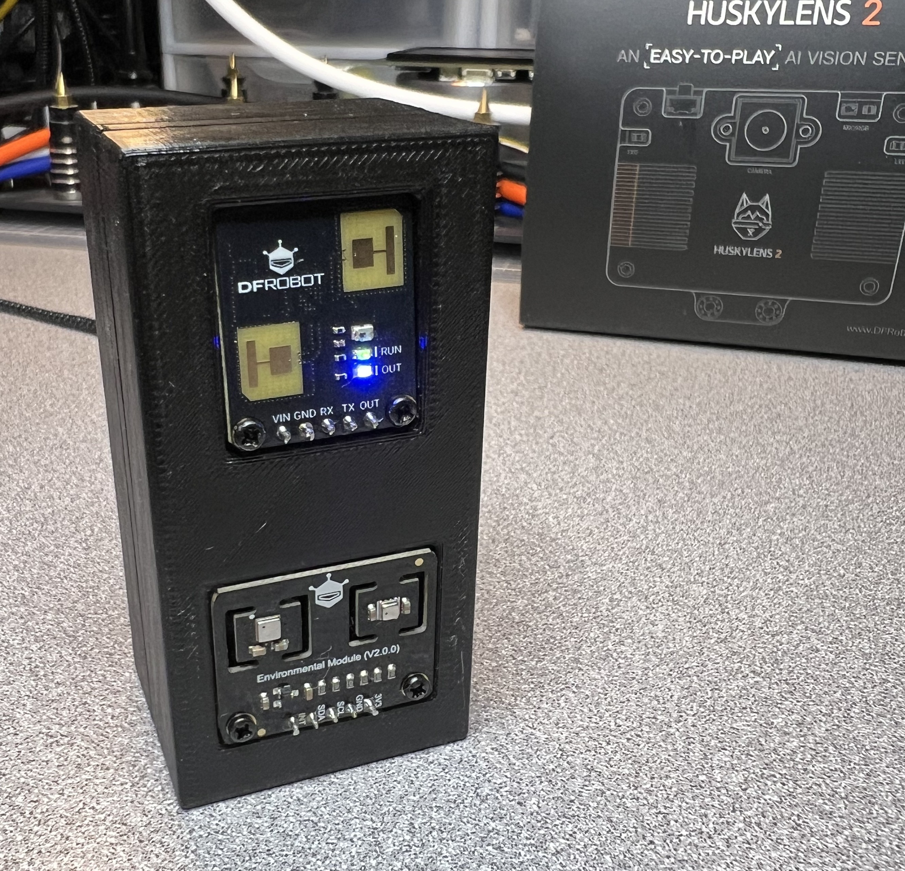
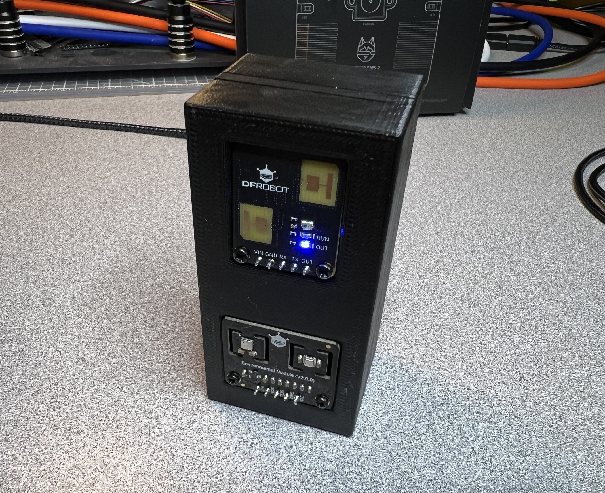
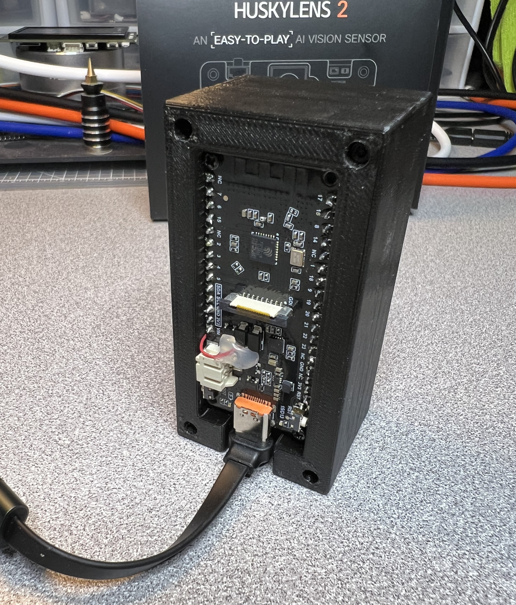
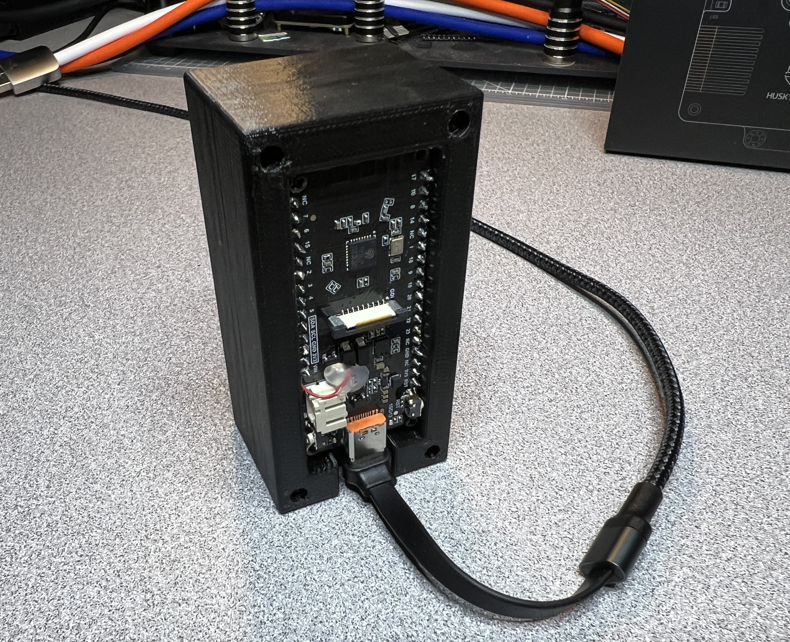
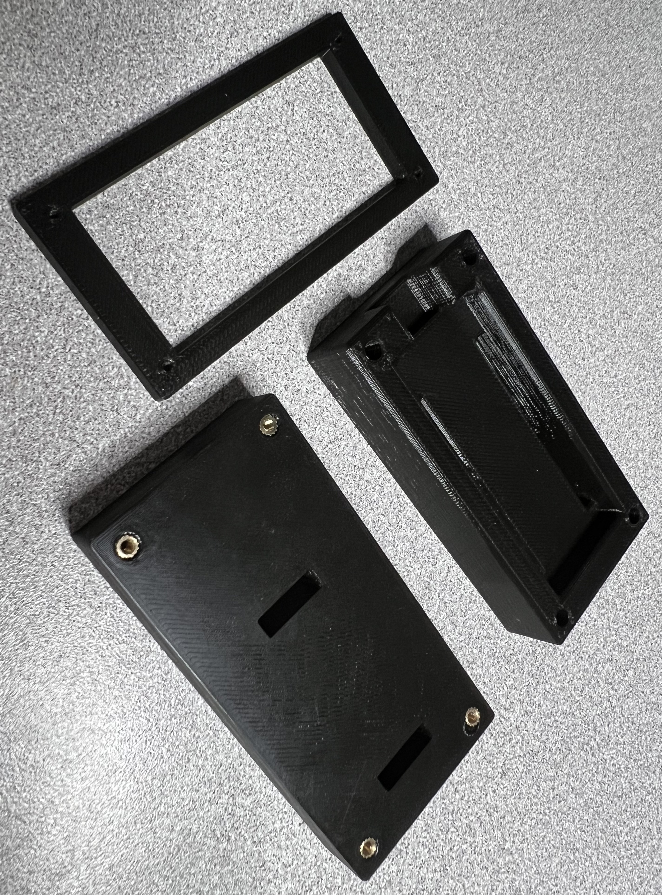
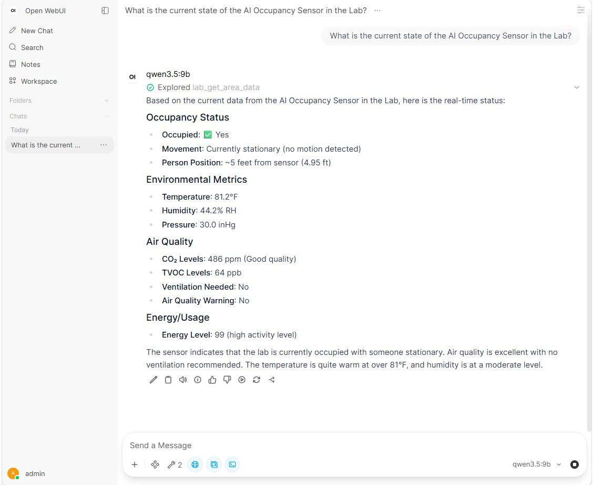

# AI Occupancy Sensor

An AI-compatible intelligent room occupancy sensor built around the FireBeetle 2 ESP32-C6, the DFRobot C4002 mmWave presence sensor, the ENS160 air-quality sensor, and the BME280 temperature/humidity/pressure sensor.

Primary program in this repo:

- `AI_Occupancy_Sensor.ino` (main Arduino sketch and active runtime)

`AI_Occupancy_Sensor.md` is the canonical architecture document for the AI Occupancy Sensor project.

## Technology stack

- Hardware: FireBeetle 2 ESP32-C6
- Sensors: DFRobot C4002 mmWave, ENS160, BME280
- Firmware: Arduino sketch in C++
- Connectivity: Wi‑Fi, MQTT, local HTTP server, MCP JSON-RPC over HTTP
- Integration: Home Assistant and Open WebUI via local MQTT/MCP exposure
- Enclosure: 3D-printed case with STL files in the [case](case) folder

## What the current firmware does

- Initializes the I2C bus and the C4002 UART link.
- Polls the C4002, ENS160, and BME280 sensors.
- Fuses the raw readings into a room context that tracks occupancy, motion, occupancy duration, and simple air-quality guidance.
- Runs with sensor degradation tolerance: ENS160 and BME280 failures are logged and tolerated, while the C4002 is required for the node to start.
- Keeps placeholder hooks for MQTT, HTTP, and MCP output so the runtime shape is in place while those interfaces are finished.

## Current code path

- [AI_Occupancy_Sensor.ino](AI_Occupancy_Sensor.ino) is the primary runtime and source of truth for behavior, MCP endpoints, and serial telemetry.
- The sketch owns the sensor polling, context inference, local config loading, and the MCP/HTTP integration points used by the node.

## Shared configuration

The project uses a single shared configuration header for local network and runtime settings: [config.h](config.h).

This file is the source of truth for:

- Wi‑Fi SSID and password
- MQTT broker host, port, username, and password
- MQTT state and availability topic names
- MCP HTTP port (`MCP_HTTP_PORT`)

The Arduino sketch uses this file directly rather than redefining network settings in multiple places.

## Local configuration template

Create a local copy of [config.h.example](config.h.example) named `config.h` and replace each placeholder value before compiling:

- `WIFI_SSID`
- `WIFI_PASSWORD`
- `MCP_HTTP_PORT`
- `MQTT_BROKER_HOST`
- `MQTT_BROKER_PORT`
- `MQTT_USERNAME`
- `MQTT_PASSWORD`
- `MQTT_TOPIC_STATE`
- `MQTT_TOPIC_AVAILABILITY`
- `TEMP_OFFSET_F`
- `HUMIDITY_OFFSET_RH`

Keep the real `config.h` file local to your machine and do not commit credentials to source control.

## Sensor calibration offsets

The BME280 readings can be corrected in `config.h` using these optional offsets:

- `TEMP_OFFSET_F`: Temperature correction in Fahrenheit.
- `HUMIDITY_OFFSET_RH`: Relative humidity correction in RH percentage points.

Temperature offset is entered in Fahrenheit for convenience, then converted internally to Celsius before being applied to sensor values.

Examples:

- If the sensor reads 82.0F and a reference thermometer reads 79.5F, set `TEMP_OFFSET_F = -2.5f`.
- If the sensor reads 39% RH and a reference reads 42% RH, set `HUMIDITY_OFFSET_RH = 3.0f`.

Notes:

- Positive offsets increase reported values; negative offsets decrease them.
- Corrected humidity is clamped to the valid range of 0 to 100% RH.
- Offsets are applied in the current Arduino sketch and any future local port of the same logic.

## Hardware defaults

These defaults are defined in [config.h](config.h):

- Device name: `room-ai-node`
- C4002 UART TX: GPIO 16
- C4002 UART RX: GPIO 17
- C4002 baud rate: `115200`
- I2C SDA: GPIO 19
- I2C SCL: GPIO 20
- I2C clock: `400000`
- MCP HTTP port: `8081`
- MQTT broker host and Wi‑Fi credentials: blank placeholders for local configuration

## Power note for the C4002

The C4002 required more power than the ESP32 board could reliably supply through its GPIO header pins alone. In the current build, the sensor is powered from the ESP32 board's USB 5V rail via a red tap wire visible in the back-case photo. This is a deliberate external power feed for the sensor and is not provided through the ESP32's GPIO pin supply path.

The power tap is a practical hardware workaround to keep the C4002 stable while the ESP32 continues to operate as the controller and local intelligence node.

## Quick start

1. Install the Arduino core for the ESP32-C6 and select the correct board profile in Arduino IDE or VS Code.
2. Copy [config.h.example](config.h.example) to `config.h` and fill in your Wi‑Fi, MQTT, and MCP values.
3. Connect the ESP32-C6 via USB and compile/upload [AI_Occupancy_Sensor.ino](AI_Occupancy_Sensor.ino).
4. Open the serial monitor at 115200 baud to confirm startup logs and sensor readiness.
5. Test the local HTTP endpoint at `http://DEVICE_IP:8081/context` and the MCP endpoint at `http://DEVICE_IP:8081/mcp`.
6. Validate the MCP flow using [MCP-Test.ps1](MCP-Test.ps1) or the examples in [MCP-Testing.md](MCP-Testing.md).

## Troubleshooting

- No serial output: confirm the board profile is set to the ESP32-C6 and USB CDC is enabled.
- C4002 not responding: verify UART wiring and confirm the sensor is receiving stable power from the USB 5V rail as noted in the power section above.
- Wi‑Fi not connecting: verify SSID/password in [config.h](config.h) and check that the board is on the correct network.
- MCP requests failing: use POST with `Content-Type: application/json` and verify the JSON-RPC method names match the runtime implementation.
- Sensor values look wrong: check calibration offsets in [config.h](config.h) and confirm the board and sensor are still physically connected.

## Case build and Open WebUI validation

The repository includes current photos of the case, the printable STL enclosure files, and a screenshot showing live sensor data in Open WebUI.

3D case STL files:

- [case/Case3_front.stl](case/Case3_front.stl) — front panel shell
- [case/Case3_middle.stl](case/Case3_middle.stl) — middle body section
- [case/Case3_back.stl](case/Case3_back.stl) — rear enclosure panel

Case images:

- Front view:

	

- Front view (alternate angle):

	

- Back view:

	

- Back view (alternate angle):

	

- Parts and internal layout:

	

Open WebUI integration:

- Live sensor view in Open WebUI via MCP:

	

Home Assistant integration:

- Live sensor entities and state in Home Assistant:

	

## Console output

The `AI_Occupancy_Sensor.ino` sketch writes startup and loop logs to the serial console at `115200` baud. USB CDC on Boot must be enabled for the ESP32-C6 board profile, and on boards that expose USB CDC you should open the monitor before or immediately after reset so the startup banner is not missed.

Current runtime behavior in the sketch:

- C4002 is polled continuously in the main loop.
- Telemetry is published to serial every 5 seconds.
- Output is grouped with a sample header line.

Current sample format:

```text
--- sample 12 t=60234ms ---
occupied=1 moving=0 stationary=1 vent=0
C4002 present=1 motion=0 static=1 dist=5.22ft energy=99
ENS160 ready=1 eco2=552 tvoc=101
BME280 ready=1 temp=82.67F humidity=41.10% pressure=30.04inHg
```

Field notes:

- `occupied`, `moving`, `stationary`, and `vent` are derived context-engine outputs.
- C4002 distance is displayed in feet (`ft`).
- BME280 temperature is displayed in Fahrenheit (`F`).
- BME280 pressure is displayed in inches of mercury (`inHg`).
- C4002 intensity is labeled `energy` (renamed from `activity`).

## Repo layout

- `AI_Occupancy_Sensor.ino` is the main Arduino program.
- `AI_Occupancy_Sensor.md` is the primary architecture and design document.
- `README.md` is the quick-start and operational guide.
- `config.h` and `config.h.example` hold the local network and runtime settings.

## MCP tool contract

Current MCP tool names advertised by tools/list in AI_Occupancy_Sensor.ino:

- get_area_data: Returns real-time environmental and occupancy metrics for the area.
- get_environmental_data: Returns temperature, humidity, and pressure metrics.
- get_occupancy_data: Returns presence, motion, static presence, distance, and energy.
- get_air_quality_data: Returns eCO2 and TVOC metrics.

Tool name change note:

- Previous call names without the `get_` prefix were replaced with the `get_` prefixed names above.
- tools/list and tools/call must use the same canonical names.

MCP session limit note:

- The intended design target is 2 concurrent MCP sessions (`MAX_MCP_SESSIONS = 2`).
- The current Arduino sketch does not yet enforce a real session-cap tracking layer at runtime; this is a design target rather than a live runtime limit.

When tool names or descriptions change, align these locations:

- AI_Occupancy_Sensor.ino: tools/list tool metadata and tools/call routing checks.
- MCP-Test.ps1: JSON-RPC tools/call test payload names.
- MCP-Testing.md: expected tool list and tools/call request examples.
- AI_Occupancy_Sensor.md: MCP tool examples and architectural references.

## Acknowledgement

Special thanks to DFRobot for providing the hardware used in this project as part of their C4002 Free Trial Program.

Kit 3: Multi-Sensor Fusion Kit (Enabling richer environmental sensing)

Included hardware:

- FireBeetle 2 ESP32-C6 x 1 (DFR1075)
- Fermion C4002 mmWave Human Presence Sensor x 1 (SEN0691)
- Fermion ENS160 + BME280 Environmental Sensor x 1 (SEN0335)

## License

This project is licensed under the MIT License. See [LICENSE](LICENSE) for the full text.
